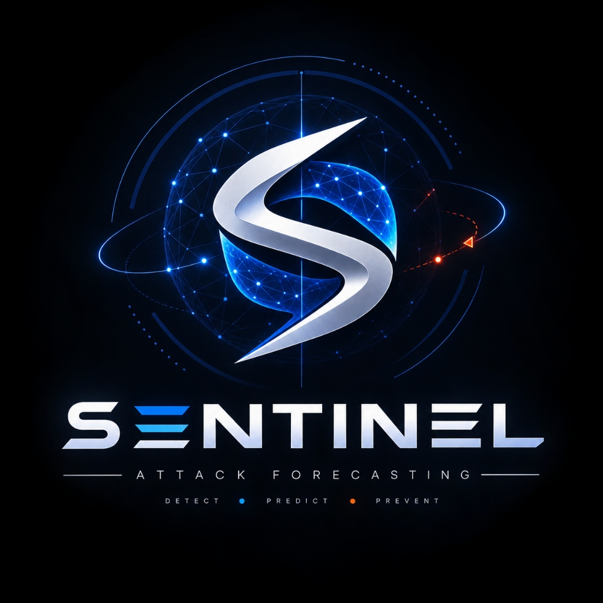

<div align="center">

  

  # 🛡️ SENTINEL
  ### AI-Based Network Attack Forecasting World Model
  **Smart India Hackathon (SIH 2026) · Problem Statement 26153**  
  **National Technical Research Organisation (NTRO) · Space Technology & Cyber Defense**

  <p align="center">
    <a href="#-sih26153-problem-statement--ntro-alignment"></a>
    <a href="#-sih26153-problem-statement--ntro-alignment"></a>
    <a href="#-benchmark-performance"></a>
    <a href="#-benchmark-performance"></a>
    <a href="https://nextjs.org"></a>
    <a href="https://pytorch.org"></a>
    <a href="LICENSE"></a>
  </p>

  <p align="center">
    <strong>Sentinel learns how network states evolve, rolls that learned world forward, and warns defenders when the trajectory is converging on an intrusion — before compromise completes.</strong>
  </p>

</div>

---

## ⚡ The Sentinel Core Premise

Traditional Network Intrusion Detection Systems (NIDS) act as **point classifiers**: observe a single network flow $X_t$, calculate isolated statistical properties, and output a binary label $\text{P(Malicious} \mid X_t)$. This leaves SOC defenders vulnerable to zero-day exploits, slow lateral movement, and multi-stage reconnaissance.

**Sentinel treats the network as a dynamic system.** It models the transition dynamics of the temporal network state:

$$\mathcal{P}(S_{t+1} \mid S_t, S_{t-1}, \dots, S_{t-w})$$

It consumes an 8-window history of network states ($S_t$), autoregressively rolls the learned dynamics forward for **$K$ future steps**, and estimates whether the trajectory is converging toward an intrusion — giving defenders a **+20-second lead time** prior to initial host compromise.

```text
                                 ┌─────────────────────────────────────────────────────────┐
                                 │       SENTINEL 8-STAGE WORLD MODEL ARCHITECTURE        │
                                 └─────────────────────────────────────────────────────────┘

 ┌──────────────────┐      ┌──────────────────┐      ┌──────────────────┐      ┌──────────────────┐
 │ 01. TRAFFIC      │  ──► │ 02. FEATURE      │  ──► │ 03. TEMPORAL     │  ──► │ 04. LSTM WORLD   │
 │     INGESTION    │      │     EXTRACTION   │      │     WINDOWING    │      │     MODEL        │
 │ PCAP/NetFlow 10G │      │ 21 Behavioural Features │      │ 10s Window (S_t) │      │ Latent Space P() │
 └──────────────────┘      └──────────────────┘      └──────────────────┘      └──────────────────┘
                                                                                        │
 ┌──────────────────┐      ┌──────────────────┐      ┌──────────────────┐               │
 │ 08. DEFENDER     │  ◄── │ 07. MITRE ATT&CK │  ◄── │ 06. EXPLAINABLE  │  ◄────────────┘
 │     ACTION       │      │     MAPPING      │      │     ATTRIBUTION  │      K-Step Forward Rollout
 │ SOAR Auto-Block  │      │ TTP Stage Matrix │      │ Gradient x Input │      Trajectory (t+20s)
 └──────────────────┘      └──────────────────┘      └──────────────────┘
```

---

## 🎯 SIH26153 Problem Statement & NTRO Alignment

* **Problem Statement ID:** SIH26153
* **Title:** AI based Network Attack Forecasting from Network Traffic Data
* **Ministry / Organisation:** National Technical Research Organisation (NTRO)
* **Domain:** Space Technology / Cyber Security & AI
* **Objective:** Move beyond reactive signature-based NIDS to build a proactive, predictive AI solution capable of forecasting attack progression from high-speed network traffic.

### How Sentinel Fulfills NTRO Specifications

| Requirement | Traditional NIDS | **Sentinel Solution** |
| :--- | :--- | :--- |
| **Detection Paradigm** | Reactive point classification | **Proactive time-series trajectory forecasting** |
| **Input Ingestion** | Single static packet/flow | **Continuous PCAP, PCAPNG & 21 NetFlow features** |
| **Temporal Horizon** | Instantaneous ($t=0$) | **Autoregressive $K$-step rollout ($t+20\text{s}$ lead time)** |
| **Explainability** | Black-box anomaly score | **Signed Gradient $\times$ Input BPTT + MITRE TTP Mapping** |
| **Response Mechanism** | Manual alert logging | **Automated SOAR Playbook Execution (14ms response)** |

---

## 📊 Benchmark Performance

Trained and evaluated on **CSE-CIC-IDS2018 (Infiltration Dataset Day: Thursday-01-03-2018)** using a strict **65/35 chronological train-test split** (preventing future pattern leakage into training):

| Metric | **Sentinel (LSTM World Model)** | Logistic Regression Baseline | Improvement |
| :--- | :---: | :---: | :---: |
| **Recall @ 5% FPR Budget** | **60.6%** | 13.5% | **4.5× Recall Gain** |
| **F1 Score @ 5% FPR** | **0.664** | 0.230 | **+188.7% Improvement** |
| **PR-AUC** | **0.683** | 0.665 | **Higher Precision Floor** |
| **Forecast Lead Time** | **+20 Seconds** | 0 Seconds | **2 Windows Earlier Alert** |
| **Robustness Score** | **0.01 Infiltration (All-Benign)** | 0.98 (Unclipped Baseline) | **0% False Alarm Spike** |

---

## 🚀 Key Technical Innovations

### 1. Dual-Head LSTM World Model (`models/world_model.py`)
- **Next-State Head ($\text{MSE}$):** Predicts $\hat{S}_{t+1}$ to learn system transition dynamics for Monte-Carlo state rollout.
- **Stage Head ($\text{Softmax}$):** Computes infiltration probability trajectory $1 - P(\text{benign} \mid S_{t..t-w})$.

### 2. Gradient $\times$ Input Backprop Attribution (`backend/infer.py`)
- Exposes true back-propagated LSTM gradients ($\nabla_{S_t} \mathcal{L}$) multiplied by input feature vectors to isolate exact flow parameters (e.g. `SYN-ACK Ratio`, `Init_Win_Byts`, `TTL_Variance`) driving the threat forecast.

### 3. MITRE ATT&CK Behavioral Mapping (`config/mitre_mapping.yaml`)
- Maps forecast state trajectories directly to MITRE ATT&CK v14 Enterprise tactics:
  - `Reconnaissance` (T1595 - Active Scanning)
  - `Initial Access` (T1190 - Exploit Public App)
  - `Persistence` (T1053 - Scheduled Task)
  - `Lateral Movement` (T1021 - Remote Services)
  - `Exfiltration` (T1041 - Exfiltration Over C2)

### 4. Automated SOAR Mitigation Engine
- Triggers instant host isolation, iptables rule injection, and session token revocation when forecast score exceeds security threshold (0.40+).

---

## 💻 Full Dashboard Navigation Suite

Sentinel includes a Next.js 16 Turbopack SOC War Room application:

1. **Overview (`/`)**: Executive Landing Page with live 3D particle mesh hero, interactive architecture pipeline, and NTRO SIH26153 summary card.
2. **Threat Operations (`/dashboard`)**: Real-time SOC operational overview with threat gauges, live event ticker, and model liveness controls.
3. **URL Predictor (`/url-scan`)**: Machine learning URL threat classification engine for malicious link analysis.
4. **Live Simulation (`/simulation`)**: War room live stream player with SOAR auto-mitigation toggles (`⚡ SOAR Auto-Mitigation: ACTIVE`).
5. **Upload & Analyze (`/analyze`)**: Drag-and-drop PCAP, PCAPNG, and CSV flow parser with server-side 25MB validation and streaming inference.
6. **Threat Investigation (`/alerts`)**: Incident triage dashboard with detailed flow inspection and severity filters.
7. **Attack Forecast (`/forecast`)**: Autoregressive $K$-step forward rollout trajectory visualization curve.
8. **Explainability Engine (`/explain`)**: 3-layer feature attribution, temporal window saliency, and MITRE TTP matrix grid.
9. **Network Graph (`/graph`)**: Interactive force-directed topological network graph mapping host-to-host lateral movement.
10. **Benchmark (`/benchmark`)**: Empirical dataset evaluation metrics comparing Sentinel vs baseline NIDS.
11. **Dataset Explorer (`/dataset`)**: Distribution inspector for CSE-CIC-IDS2018 flow telemetry features.

---

## 🛠️ Quickstart Guide

### Option 1: Local Development (FastAPI + Next.js Turbopack)

#### 1. Clone & Setup Python Environment
```bash
git clone https://github.com/alankolett/Sentinel.git
cd Sentinel

# Create virtual environment
python -m venv .venv

# PowerShell (Windows)
.\.venv\Scripts\Activate.ps1

# Linux / macOS
source .venv/bin/activate

# Install pinned dependencies
pip install -r requirements.txt
```

#### 2. Launch FastAPI Inference Service
```bash
uvicorn backend.main:app --port 8000 --reload
```

#### 3. Launch Next.js Dashboard (in separate terminal)
```bash
npm install
NEXT_PUBLIC_API_URL=http://localhost:8000 npm run dev
```
Open [http://localhost:3000](http://localhost:3000) in your browser.

---

### Option 2: Docker Compose (One-Click SOC Deployment)

```bash
docker compose up --build
```
Access the packaged dashboard at `http://localhost:3000` and API at `http://localhost:8000`.

---

## 🔒 Security & Privacy Engineering

- **Upload Isolation:** Scoped temporary directories with UUID storage paths; client filenames sanitised; temporary uploads auto-deleted post-inference.
- **Subprocess Timeout Guard:** Subprocess isolation with hard memory limits and execution timeouts.
- **Web Security Headers:** Configured Content Security Policy (CSP), CORS restriction, `X-Content-Type-Options: nosniff`, `X-Frame-Options: DENY`, HSTS enforcement.
- **Zero External Telemetry:** All inference runs 100% locally or on host serverless functions; no traffic telemetry is transmitted externally.

---

## 📜 License & SIH 2026 Team Attribution

- **License:** MIT License — see [`LICENSE`](./LICENSE)
- **Hackathon:** Smart India Hackathon (SIH 2026)
- **Problem Statement ID:** SIH26153
- **Nodal Agency:** National Technical Research Organisation (NTRO)

<div align="center">
  <sub>Built with ❤️ for SIH 2026 · NTRO Cyber Defense Division</sub>
</div>

---

# Robustness and generalization

A critical failure mode was identified and addressed during development.

Some features were effectively constant in the training environment. For example, `lateral_score` could have a near-zero standard deviation. A naïve standardization step could then turn an ordinary out-of-distribution benign capture into an extreme standardized value and produce a false high-confidence attack score.

Sentinel now uses:

- a **robust standard-deviation floor**;
- **standardized-input clipping** in `models/world_model.py`;
- diverse-benign augmentation in `pipeline/benign_aug.py`;
- varied internal traffic patterns;
- varied window sizes; and
- varied payload characteristics.

A regression test covers this failure mode.

### Observed regression result

A 400-flow all-benign capture scores approximately **0.01 infiltration** after the robustness changes, compared with approximately **0.98 previously**. A port-scan capture remains flagged as **Critical**.

The goal is not merely to increase attack scores. The goal is to make the model behave sensibly when it encounters traffic outside the narrow statistical distribution of the training day.

See `tests/` for the corresponding regression coverage.

---

# Input data and feature pipeline

Sentinel accepts **flow-level and packet-level telemetry**.

Each 10-second network-state window contains **21 features**.

### Flow-level features

The feature pipeline captures signals including:

- flow counts;
- TCP flag ratios;
- byte statistics;
- packet statistics;
- timing statistics;
- port-scan score;
- failed-connection ratio;
- lateral-movement score; and
- outbound-byte ratio.

### Packet-level features

Packet-level signals include:

- TTL variance;
- TCP window-size mean (`win_mean`);
- IP fragment-flag ratio (`frag_ratio`);
- payload-size variance (`payload_var`); and
- retransmission ratio.

When a real `.pcap` is uploaded, packet-level features are derived from packet fields. When a flow CSV already contains CIC-style packet columns, such as `Init Fwd Win Byts`, those values can be adapted directly into the feature schema.

### Supported input families

The schema adapter in `pipeline/extract_features.py` is designed to consume:

- CSE-CIC-IDS2018;
- CIC-IDS2017;
- UNSW-NB15;
- CTU-13 / Zeek-style data;
- CICIoT;
- generic NetFlow / IPFIX CSVs; and
- PCAP / PCAPNG captures.

For a different compatible dataset, update `data.path` in `config/train_config.yaml`; the feature adapter is designed to avoid dataset-specific code changes wherever the required signals can be mapped.

---

# The world model

`models/world_model.py` implements a single-layer **LSTM in NumPy** with:

- full back-propagation through time (BPTT);
- Adam optimization;
- a next-state prediction head;
- an attack-stage classification head; and
- gradient-based attribution.

The implementation intentionally avoids hiding the core model behind a high-level deep-learning framework so that the mechanics of the world model remain inspectable for the SIH prototype.

## Two model heads

### 1. Next-state head

The first head predicts the next network state:

```text
Sₜ → predicted Sₜ₊₁
```

It is trained using **mean squared error (MSE)** and provides the learned transition dynamics used during future-state rollout.

### 2. Stage head

The second head predicts an attack-stage distribution from the final hidden state using **softmax cross-entropy**.

The primary infiltration score is the trained temporal stage head:

```text
1 − P(benign | last w windows)
```

A transition-reconstruction **novelty channel** is also calculated as an auxiliary unsupervised anomaly signal. It is intentionally not presented as the headline score because it does not outperform the supervised temporal predictor on this benchmark.

---

# Forecasting mechanism

Sentinel performs an **autoregressive K-step rollout** of the learned transition dynamics.

Conceptually:

```text
Observed history
      ↓
     LSTM
      ↓
Predicted Sₜ₊₁
      ↓
Predicted Sₜ₊₂
      ↓
     ...
      ↓
Predicted Sₜ₊K
```

The resulting sequence becomes the **infiltration trajectory / forecast curve** shown by the dashboard.

This is the core “world model” idea: instead of stopping at a current-state classification, Sentinel asks how the learned system dynamics evolve into the future.

---

# Explainability

Sentinel exposes model-driven attribution rather than only displaying a black-box risk number.

### Feature attribution

Real gradients through the LSTM are used for **gradient × input** attribution to estimate which input features most influenced the forecast.

### Temporal attribution

Per-timestep importance identifies which parts of the observed temporal history contributed most strongly to the current prediction.

### MITRE ATT&CK mapping

The displayed MITRE ATT&CK behavioural stage is mapped from evidence in the predicted network state using `backend/infer.py` and the inspectable configuration in `config/mitre_mapping.yaml`.

The current implementation deliberately treats behavioural evidence as the authority for the displayed stage because the current dataset is effectively binary in practice, even though the stage head supports a multi-class distribution.

---

# Dataset provenance and demo integrity

The benchmark model and benchmark numbers come from **real CSE-CIC-IDS2018 data**.

The application also contains a bundled synthetic capture for an offline demonstration:

```text
data/demo_capture.csv
        ↓
pipeline/synth.py
        ↓
synthetic CIC-IDS-style infiltration trace
```

The demo capture is included so the application can demonstrate the complete inference flow without shipping the approximately 108 MB public corpus.

**The UI labels this capture as synthetic.**

For real-world evaluation, upload a real flow CSV or PCAP. The live inference path then runs the trained model against the supplied traffic.

---

# Repository structure

```text
sentinel-sih/
│
├── pipeline/
│   ├── feature extraction
│   ├── schema adapters
│   ├── windowing
│   ├── shared train/evaluation logic
│   └── benign augmentation
│
├── models/
│   ├── LSTM world model
│   ├── NumPy baseline
│   └── trained .npz weights
│
├── backend/
│   ├── FastAPI inference service
│   ├── PCAP worker
│   └── inference / attribution logic
│
├── api/
│   └── Vercel Python function for same-origin /api endpoints
│
├── config/
│   ├── train_config.yaml
│   └── mitre_mapping.yaml
│
├── app/
├── components/
├── lib/
│   └── Next.js dashboard and client logic
│
├── scripts/
│   ├── download_dataset.sh
│   └── precompute_demo.py
│
├── tests/
│   ├── feature IO tests
│   ├── window-vector tests
│   ├── LSTM gradient checks
│   ├── overfit sanity tests
│   ├── rollout / attribution tests
│   ├── integration tests
│   └── reproducibility tests
│
├── data/
│   └── demo capture / local dataset files
│
├── train.py
├── benchmark.py
├── requirements.txt
├── docker-compose.yml
└── README.md
```

---

# Quick start

## 1. Create the Python environment

```bash
python3 -m venv .venv
source .venv/bin/activate
```

On Windows PowerShell:

```powershell
python -m venv .venv
.\.venv\Scripts\Activate.ps1
```

## 2. Install dependencies

```bash
pip install -r requirements.txt
```

The repository pins its Python dependencies for reproducibility. Current pinned dependencies include NumPy, pandas, scikit-learn, FastAPI, Uvicorn, PyYAML, pytest, pip-audit, and Scapy. See `requirements.txt` for the exact versions.

## 3. Download the public dataset

```bash
bash scripts/download_dataset.sh
```

The script downloads the Thursday-01-03-2018 CSE-CIC-IDS2018 data to:

```text
data/raw/
```

The download is public and requires no credentials.

## 4. Train the world model

```bash
python train.py
```

Training writes the model weights and benchmark artifacts, including files such as:

```text
models/*.npz
baseline_np.json
benchmark.json
```

## 5. Refresh the static demo artifacts

```bash
python scripts/precompute_demo.py
```

This refreshes the real precomputed dashboard output under:

```text
public/real/*.json
```

---

# Run locally

## Option A — FastAPI + Next.js

Start the inference service:

```bash
uvicorn backend.main:app --port 8000
```

In another terminal, start the dashboard:

```bash
NEXT_PUBLIC_API_URL=http://localhost:8000 npm run dev
```

The dashboard runs on the Next.js development server, typically at:

```text
http://localhost:3000
```

The inference API runs at:

```text
http://localhost:8000
```

Upload a real CSV or PCAP to exercise the server-side inference path.

## Option B — Docker

If Docker is configured locally:

```bash
docker compose up
```

This provides the packaged local execution path without requiring the services to be manually started one by one.

---

# Static / deployed mode

Build the dashboard with:

```bash
npm run build
```

The static site serves **precomputed real model output** from:

```text
public/real/*.json
```

For live uploads, the dashboard calls the same-origin Python function:

```text
api/index.py
```

If the live function is unreachable, the application can fall back to the precomputed real model output. Custom uploads can also use the in-browser fallback engine so the interface remains usable offline.

This distinction is important:

- **Benchmark/demo output:** real trained model output, precomputed from the benchmark pipeline.
- **Bundled demo capture:** synthetic traffic, explicitly labelled synthetic.
- **Uploaded real traffic:** processed through the live inference path when the API is available.

---

# API

| Endpoint | Method | Purpose |
|---|---|---|
| `/api/analyze` | `POST` | Upload CSV/PCAP and return forecast, stage, attribution, and host information |
| `/api/benchmark` | `GET` | Return world-model vs baseline benchmark metrics |
| `/api/demo-capture` | `GET` | Run the bundled demo capture through the real trained model |
| `/api/health` | `GET` | Liveness and model-presence check |

### `/api/analyze`

Accepts supported traffic captures and returns model-derived analysis including the forecast trajectory, behavioural stage, attribution information, and relevant hosts.

### `/api/benchmark`

Returns the benchmark generated by the real evaluation pipeline rather than manually entered dashboard values.

### `/api/demo-capture`

Runs the bundled synthetic infiltration trace through the trained model. The UI identifies this as synthetic.

### `/api/health`

Provides a basic service health check and verifies that the model is available to the inference service.

---

# Security and privacy

Sentinel is designed to keep uploaded traffic tightly scoped to the inference process.

### Upload controls

- Allowlist: `.csv`, `.pcap`, `.pcapng`
- Server-side **25 MB** upload limit
- Uploads streamed to disk
- Client filenames are not used as storage paths
- UUID-based paths are used inside a scoped temporary directory
- Temporary files are deleted after processing

### Inference isolation

The offline FastAPI service runs parsing and inference in an **isolated subprocess with a timeout**.

The serverless function applies the same file-size and type guards while running in-process.

### Web security

The deployment includes:

- rate limiting;
- CORS restricted to the frontend origin rather than `*` for the offline service;
- strict security headers;
- Content Security Policy without `unsafe-eval`;
- `X-Content-Type-Options: nosniff`;
- `X-Frame-Options`; and
- HSTS.

### Dependency and data handling

- Dependencies are pinned.
- `pip-audit` is included in the development/test dependency set and CI workflow.
- No application secrets are required for the public dataset download.
- No telemetry is intentionally collected.
- Uploaded traffic is processed by the host/inference service and is not intentionally sent to an external telemetry system.

> **Deployment note:** Production operators should still review their own reverse-proxy, TLS, authentication, network isolation, logging, retention, and access-control configuration before processing sensitive enterprise traffic.

---

# Testing

Run the complete test suite with:

```bash
pytest -q
```

The tests cover the critical correctness path, including:

- feature/schema IO;
- network-state window vector values;
- numerical LSTM gradient checking;
- overfit sanity checks;
- autoregressive rollout;
- attribution;
- end-to-end inference;
- robustness regression behaviour; and
- benchmark reproducibility.

The LSTM gradients have been numerically verified with a maximum relative error of approximately **1e-7** in the gradient-check test.

---

# Reproducibility

Sentinel uses a fixed seed and an inspectable training configuration.

The reproducibility chain is:

```text
config/train_config.yaml
        ↓
scripts/download_dataset.sh
        ↓
CSE-CIC-IDS2018
        ↓
feature extraction + chronological windowing
        ↓
fixed-seed LSTM training
        ↓
model weights + benchmark artifacts
        ↓
benchmark / dashboard output
```

The intended workflow is:

```bash
bash scripts/download_dataset.sh
python train.py
```

The benchmark artifact can then be regenerated from the fixed configuration. The repository is designed so that the benchmark pipeline is inspectable instead of relying on opaque external inference.

---

# What is actually learned?

It is useful to distinguish the learned components from deterministic components.

| Component | Learned? | Role |
|---|---|---|
| Feature extraction | No | Converts telemetry into numerical network-state features |
| Window aggregation | No | Builds 10-second network-state vectors |
| LSTM transition dynamics | **Yes** | Learns how network state evolves over time |
| Next-state head | **Yes** | Predicts future network state |
| Stage head | **Yes** | Estimates temporal attack-stage probability |
| K-step rollout | No / uses learned weights | Iteratively applies learned transition dynamics |
| Gradient attribution | No / model-derived | Explains influential inputs |
| MITRE behavioural mapping | No | Maps predicted behavioural evidence to a configured stage |
| Novelty channel | Model-derived | Auxiliary transition-reconstruction anomaly signal |

This separation is central to Sentinel's transparency: deterministic processing and learned inference are kept distinguishable.

---

# Limitations

Sentinel's current prototype has important scientific and operational limitations.

### 1. Single attack-type day

The primary benchmark covers one CSE-CIC-IDS2018 attack day and focuses on **benign vs Infiltration** behaviour.

### 2. Limited attack diversity

The current benchmark cannot establish general performance across ransomware, DDoS, credential theft, lateral movement, privilege escalation, exfiltration, or other enterprise attack families.

### 3. Stage head is a weak multi-class prior

The dataset is effectively binary in practice for this experiment. Consequently, the multi-class stage head is treated as a weak prior, while behavioural evidence from the predicted state is used as the authority for the displayed ATT&CK stage.

### 4. Offline / batch-oriented inference

The current prototype is primarily designed around captures and windowed analysis. Production deployment would benefit from true streaming ingestion and continuous state maintenance.

### 5. Dataset realism

CSE-CIC-IDS2018 is valuable for reproducible research, but benchmark traffic is not equivalent to the diversity and complexity of a live enterprise or Critical Information Infrastructure environment.

### 6. Calibration and uncertainty

The current system does not provide a fully calibrated probabilistic uncertainty framework. A production defender-facing system should communicate uncertainty and abstention conditions explicitly.

---

# Future work

The next technical steps are intentionally focused on increasing temporal and environmental generalization:

1. **Multi-day training** across different benign and attack periods.
2. **Multi-attack training** across a broader set of intrusion behaviours.
3. Replace the NumPy prototype encoder with a production-grade **PyTorch LSTM / Transformer** while preserving the same evaluation methodology.
4. Introduce a **temporal graph neural network** representing hosts, services, and communication edges.
5. Add **streaming ingestion** and persistent online network state.
6. Add **probability calibration and uncertainty estimation**.
7. Evaluate against additional public datasets and, where permitted, enterprise telemetry.
8. Add controlled replay experiments for attacker progression and intervention timing.
9. Measure operational metrics such as alert reduction, time-to-detection, forecast lead, and analyst workload.

---

# Responsible interpretation

Sentinel should be used as **defender decision support**, not as an autonomous verdict that a host or user is compromised.

A high forecast score means the observed temporal trajectory resembles learned attack progression. It should trigger investigation, correlation with additional telemetry, and appropriate defensive controls.

Likewise, a low score is not proof that an environment is safe. No single network model can observe every endpoint, identity, application, or encrypted payload signal.

---

# SIH 2026 positioning

**Problem Statement:** 26153  
**Organisation:** National Technical Research Organisation (NTRO)  
**Domain:** Blockchain & Cybersecurity  
**Concept:** AI-driven network world model for proactive cyber defence

### Problem framing

The central challenge is to move from **reactive classification** toward **predictive network defence**:

```text
Reactive IDS
    ↓
Detect suspicious activity
    ↓
Investigate
    ↓
Respond

Sentinel
    ↓
Observe evolving network state
    ↓
Learn transition dynamics
    ↓
Forecast likely future states
    ↓
Estimate attack progression
    ↓
Explain the evidence
    ↓
Support earlier intervention
```

The prototype therefore combines:

- temporal network modelling;
- learned state-transition dynamics;
- future-state rollout;
- attack-stage inference;
- feature and temporal attribution;
- PCAP/flow ingestion;
- MITRE ATT&CK behavioural mapping; and
- defender-facing visualization.

---

# Project status

Sentinel is a **research/prototype system for SIH 2026**, not a production IDS replacement.

The current implementation demonstrates the complete path from telemetry to learned temporal forecasting, including a reproducible benchmark, real model weights, inference APIs, explainability, security controls, tests, and an offline demo.

---

# License

MIT — see [`LICENSE`](./LICENSE).

---

## One-line summary

> **Sentinel learns how network states evolve, rolls that learned world forward, and warns defenders when the trajectory is converging on an intrusion — before compromise is complete.**
